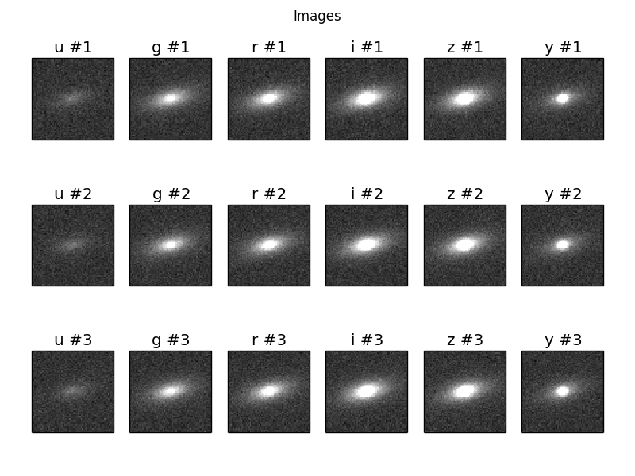
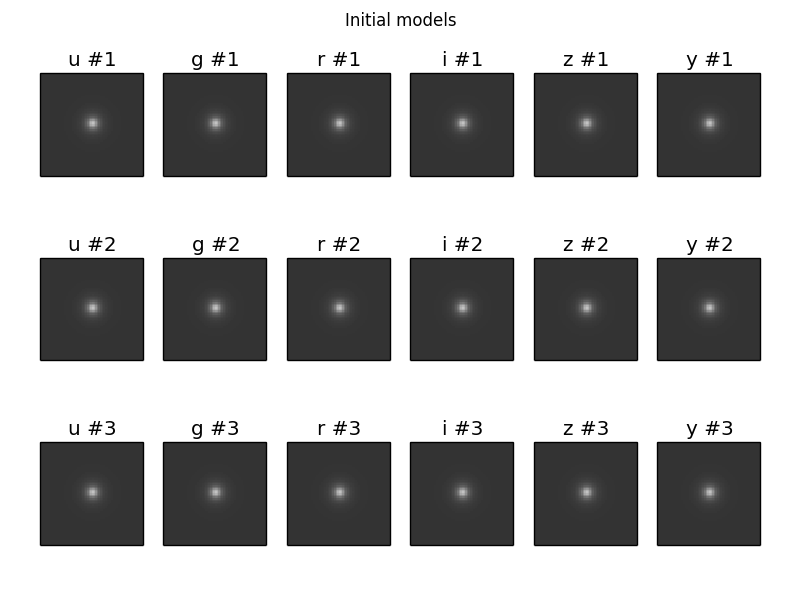
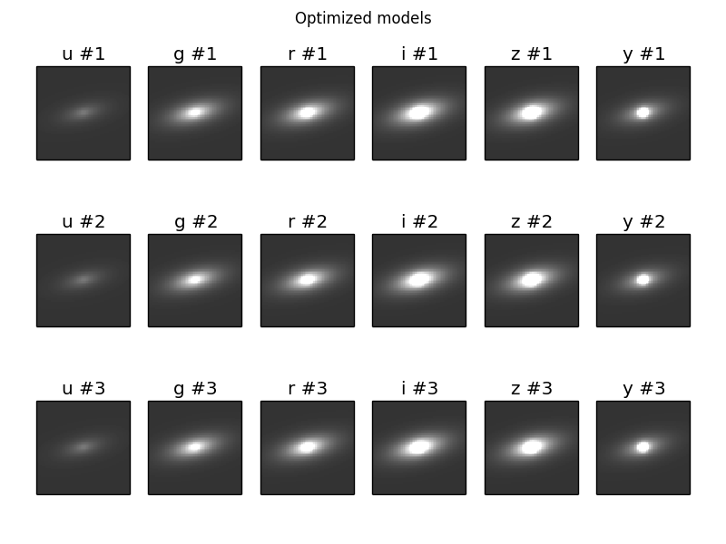
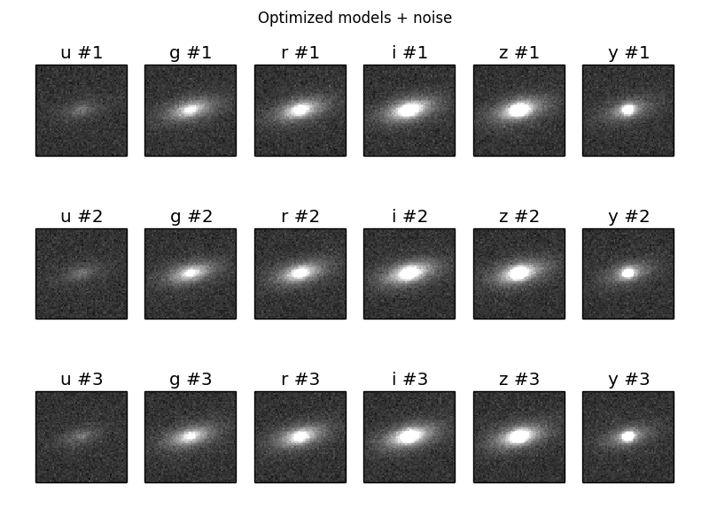

Using the Tractor with GalSim images
====================================

In the example below, we will process images generated by a modified
version of the GalSim `demo12.py` script (Original: https://github.com/GalSim-developers/GalSim/blob/master/examples/demo12.py ; Modified: https://github.com/dstndstn/tractor/blob/master/doc/galsim/demo12.py).

Using the Tractor with GalSim images requires creating a
`tractor.Image` object and source (`PointSource`, `Galaxy`) objects
describing the objects in your scene.

Let's start with the `Image`.  For some experiments you would like to
have the Tractor figure out the PSF itself, but here we will assume
you want to tell it the true PSF model that was used.  If you used a
single Gaussian PSF in GalSim, that would look like::

    from tractor import *
    psf = NCircularGaussianPSF([sigma], [1.])

Be careful about PSF widths specified as full-width at half max
(FWHM), or specified in arcseconds.  All the Tractor PSF models
describe the PSF sizes in *pixels*, and *standard deviations*
(sigmas).

For WCS, if you are working with single images, or pixel-aligned
multiple images, it will probably be easiest to work in pixel
coordinates for positions.  You will then use the `PixPos` class for
your positions, and `NullWCS` (the default) for the WCS.

For photometric calibration ("photocal"), again it will probably be
easiest to work directly in counts (`Flux` class) if you are doing
single-band images, or `Fluxes` for multi-band.  For `Flux`, you can
keep the default `NullPhotoCal`, but for `Fluxes`, use
`FluxesPhotoCal` or `LinearPhotoCal`, telling it the band name of the
image you are processing::

    from tractor import *

    flux = Fluxes(r=100, g=40)
    source = PointSource(PixPos(0.,0.), flux)

    # If we're dealing with an r-band image:
    photocal = FluxesPhotoCal('r')

The other thing you have to do is read the GalSim simulated pixels,
and set up the inverse-variance ("invvar") map.  Here I will assume
the noise in the GalSim image is pixelwise independent Gaussian of
known variance.  I will assume we are reading 3 epochs of simulated
images, stored in a "data cube" format.  The actual files used in this
example can be found in the *tractor* git repository in the
`doc/galsim` directory.

::

    import numpy as np
    import pylab as plt
    import fitsio
    from tractor import *
    from tractor.galaxy import *

    # These match the values in galsim/demo12.py
    pixnoise = 0.02
    psf_sigma = 1.5
    bands = 'ugrizy'
    nepochs = 3
    
    # Read multiple epochs of imaging for each band.
    mydir = os.path.dirname(__file__)
    tims = []
    for band in bands:
        fn = os.path.join(mydir, 'galsim', 'output', 'demo12b_%s.fits' % band)
        print 'Band', band, 'Reading', fn
        cube,hdr = fitsio.read(fn, header=True)
        print 'Read', cube.shape
        pixscale = hdr['GS_SCALE']
        print 'Pixel scale:', pixscale, 'arcsec/pix'
        nims,h,w = cube.shape
        assert(nims == nepochs)
        for i in range(nims):
            image = cube[i,:,:]
            tim = Image(data=image, invvar=np.ones_like(image) / pixnoise**2,
                        photocal=FluxesPhotoCal(band),
                        wcs=NullWCS(pixscale=pixscale),
                        psf=NCircularGaussianPSF([psf_sigma], [1.0]))
            tims.append(tim)

    # We create a dev+exp galaxy with made-up initial parameters.
    galaxy = CompositeGalaxy(PixPos(w/2, h/2),
                             Fluxes(**dict([(band, 10.) for band in bands])),
                             EllipseESoft(0., 0., 0.),
                             Fluxes(**dict([(band, 10.) for band in bands])),
                             EllipseESoft(0., 0., 0.))

    tractor = Tractor(tims, [galaxy])

    # Plot images
    ima = dict(interpolation='nearest', origin='lower', cmap='gray',
               vmin=-5.*pixnoise, vmax=20.*pixnoise)
    plt.subplots_adjust(left=0.05, right=0.95, bottom=0.05, top=0.92)
    plt.clf()
    for i,band in enumerate(bands):
        for e in range(nepochs):
            plt.subplot(nepochs, len(bands), e*len(bands) + i +1)
            plt.imshow(tims[nepochs*i + e].getImage(), **ima)
            plt.xticks([]); plt.yticks([])
            plt.title('%s #%i' % (band, e+1))
    plt.suptitle('Images')
    plt.savefig('8.png')

    # Plot initial models:
    mods = [tractor.getModelImage(i) for i in range(len(tims))]
    plt.clf()
    for i,band in enumerate(bands):
        for e in range(nepochs):
            plt.subplot(nepochs, len(bands), e*len(bands) + i +1)
            plt.imshow(mods[nepochs*i + e], **ima)
            plt.xticks([]); plt.yticks([])
            plt.title('%s #%i' % (band, e+1))
    plt.suptitle('Initial models')
    plt.savefig('9.png')

    # Freeze all image calibration parameters
    tractor.freezeParam('images')

    # Take several linearized least squares steps
    for i in range(20):
        dlnp,X,alpha = tractor.optimize()
        print 'dlnp', dlnp
        if dlnp < 1e-3:
            break

    # Plot optimized models:
    mods = [tractor.getModelImage(i) for i in range(len(tims))]
    plt.clf()
    for i,band in enumerate(bands):
        for e in range(nepochs):
            plt.subplot(nepochs, len(bands), e*len(bands) + i +1)
            plt.imshow(mods[nepochs*i + e], **ima)
            plt.xticks([]); plt.yticks([])
            plt.title('%s #%i' % (band, e+1))
    plt.suptitle('Optimized models')
    plt.savefig('10.png')

    # Plot optimized models + noise:
    plt.clf()
    for i,band in enumerate(bands):
        for e in range(nepochs):
            plt.subplot(nepochs, len(bands), e*len(bands) + i +1)
            mod = mods[nepochs*i + e]
            plt.imshow(mod + pixnoise * np.random.normal(size=mod.shape), **ima)
            plt.xticks([]); plt.yticks([])
            plt.title('%s #%i' % (band, e+1))
    plt.suptitle('Optimized models + noise')
    plt.savefig('11.png')

The resulting plots are:

This is our terrible initial guess:

Here are the optimized models:

And here are the optimized models with the expected about of per-pixel
noise added.

