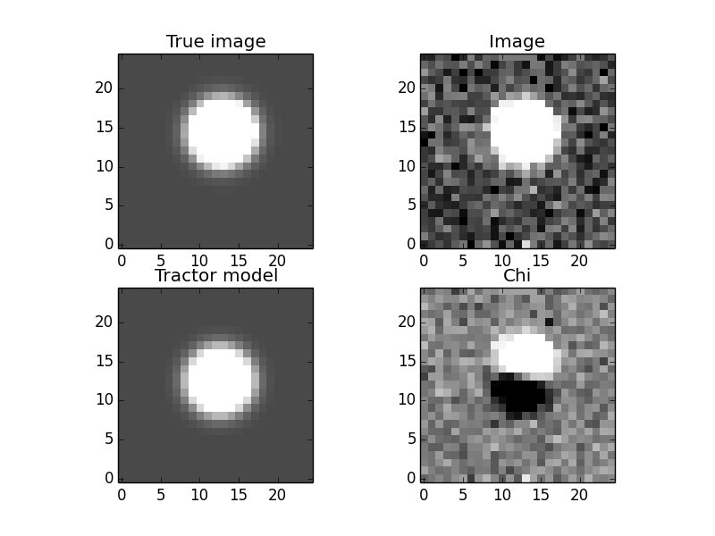
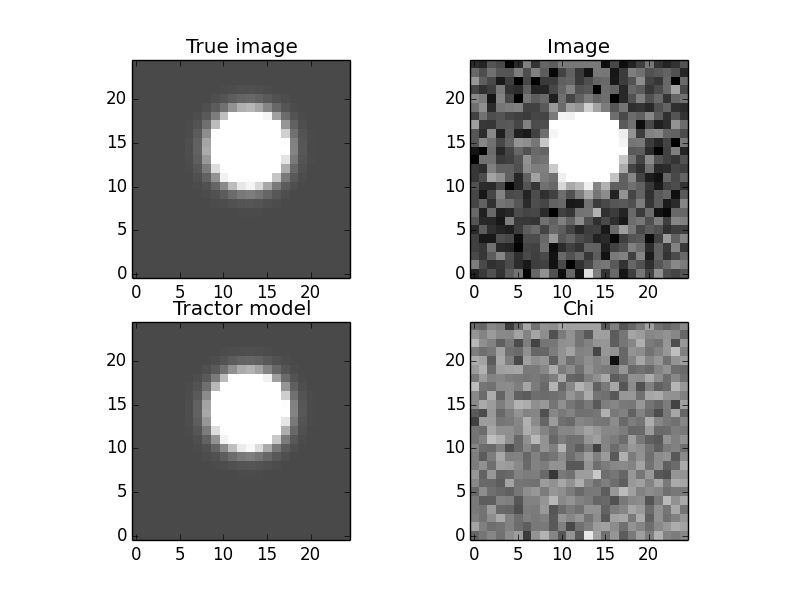
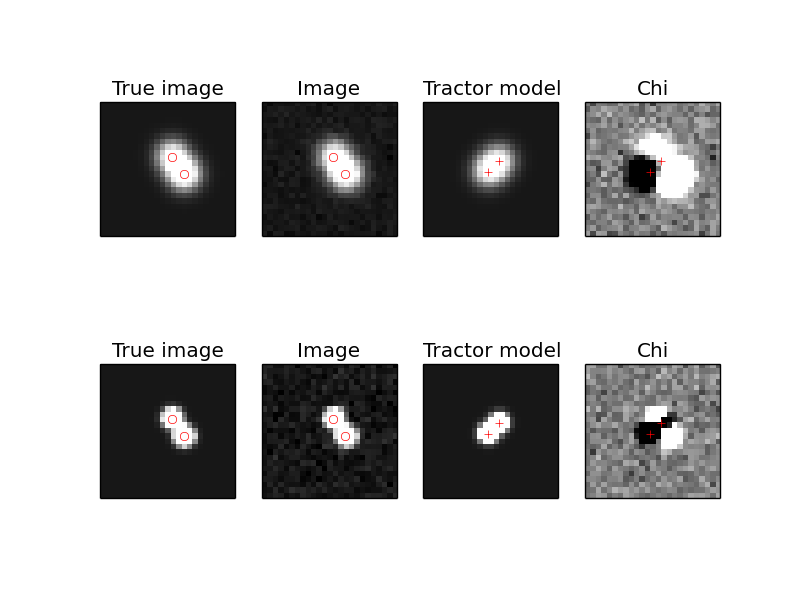
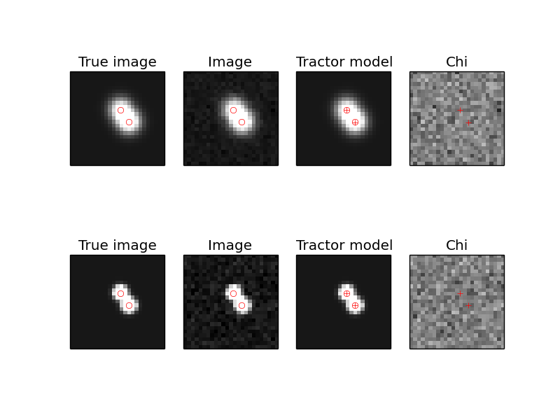

Introduction to using The Tractor
=================================

The Tractor is a code for optimizing or sampling from *models* of
astronomical objects.  The approach is *generative*: given
astronomical sources and a description of the image properties, the
code produces pixel-space estimates or predictions of what will be
observed in the images.  We use this estimate to produce a likelihood
for the observed data given the model: assuming our model space
actually includes the truth (it doesn't, in detail), then if we had
the optimal model parameters, the predicted image would only differ
from the actually observed image by noise.  Given a noise model of the
instrument and assuming pixelwise independent noise, the
log-likelihood is just the negative chi-squared difference: (image -
model) / noise.

To actually use the Tractor code to infer the properties of
astronomical objects in your images, you will probably have to write a
*driver* script, which will read in your data of interest, create
*tractor.Image* objects describing your images, and source objects
describing the astronomical sources of interest.  The Tractor does not
(at present) create sources itself; you have to initialize it with
reasonable guesses about the objects in your images.

*tractor.Image* objects carry the data, per-pixel noise sigma (we
 usually work with inverse-variance), and a number of *calibration*
 parameters.  These include the PSF model, astrometric calibration
 (WCS), photometric calibration, and sky background model.  Each of
 these calibrations can be parameterized and its parameters fit
 alongside the properties of the astronomical sources.

Sources, positions, and brightnesses
------------------------------------

*tractor.Source* objects are rather nebulously defined, as we will see
 below.  A simple example is the *tractor.PointSource* class, which
 has a "position" and a "brightness".  A *Source* object must be able
 to *render* its appearance in a given *tractor.Image*; that is, is
 must be able to produce a pixel-space model of what it would look
 like in the given image.  To do this, it must use the image's
 calibration objects to convert the source's representation of its
 position into pixel space (via the image's WCS), convert its
 representation of its brightness into pixel counts (via the image's
 photometric calibration or "photoCal").  It also needs the image's
 PSF model.

The core Tractor code does not know or care about the exact types
(python classes) you use to represent the position and brightness.
The only requirement for a "position" or "brightness" class is that it
have the right "duck type", and that the image's PhotoCal or WCS
objects can convert it to image space.  That is, the class you use for
the "position" of sources must match the class you use for the "WCS"
of the images, and the "brightness" of the sources must match the
"PhotoCal" of the images.  Let's see an example to clarify this.

In this example, we are working in pixel space and raw counts; we use
the *PixPos* class to represent pixel positions, and the *Flux* class
to represent the image counts.  We can then use the "null" calibration
classes, which just pass through the position and flux values
unmodified.

::

    from tractor import *

    source = PointSource(PixPos(17., 27.4), Flux(23.9))

    photocal = NullPhotoCal()
    wcs = NullWCS()

    counts = photocal.brightnessToCounts(source.getBrightness())
    x,y = wcs.positionToPixel(source.getPosition())
    print 'source', source
    print 'counts', counts, 'x,y', x,y

Which prints::

    source PointSource at pixel (17.00, 27.40) with Flux: 23.9
    counts 23.9 x,y 17.0 27.4

Instead, we could chose to work in RA,Dec coordinates, so we would use
the *RaDecPos* class to represent the positions of sources in
celestial coordinates, and one of the WCS calibration classes that
expect celestial coordinates.  Similarly, we could decide to work with
brightness represented in *Mags*, and use a *MagsPhotoCal*.

::

    from tractor import *
    from astrometry.util.util import Tan

    source = PointSource(RaDecPos(42.3, 9.7), Mags(r=12., i=11.3))

    photocal = MagsPhotoCal('r', 22.5)
    wcs = FitsWcs(Tan(42.0, 9.0, 100., 100., 0.1, 0., 0., 0.1, 200., 200.))

    counts = photocal.brightnessToCounts(source.getBrightness())
    x,y = wcs.positionToPixel(source.getPosition())

    print 'source', source
    print 'photocal', photocal
    print 'wcs', wcs
    print 'counts', counts, 'x,y', x,y

Which prints::

    source PointSource at RaDecPos: RA, Dec = (42.30000, 9.70000) with Mags: i=11.3, r=12
    photocal MagsPhotoCal(band=r, zp=22.500)
    wcs FitsWcs: x0,y0 0.000,0.000, WCS TAN: crpix (100.0, 100.0), crval (42, 9), cd (0.1, 0, 0, 0.1), image 200 x 200
    counts 15848.9319246 x,y 101.957357071 106.001652903

Notice a few things here: we created a *Mags* object with *r* and
*i*-band mags.  Then when we created the *photocal*, we told it that
this image is *r* band.  The Tractor doesn't care how many parameters
you use to represent your brightness, all it cares is that your
*PhotoCal* class can convert it to counts.  You could imagine
representing a star's brightness in terms of angular diameter and
black-body temperature, and have your PhotoCal integrate its spectrum
through a filter curve.

In this example, we gave the source magnitudes in two different bands.
If we had, say, an image in each band, we count then fit its position
and flux in both bands.  The position (in RA,Dec) would be fit to
jointly optimize the likelihood in the two images, while the fluxes
would be fit independently of each other.  The *r*-band image would
just have nothing to say about the *i*-band magnitude, and vice versa.

In the Tractor code, the "duck types" are defined in the file
*tractor/ducks.py*.  This code is not actually used, it is just
documentation written in code.  A toolbox of typical choices for
position and brightness and their corresponding WCS and PhotoCal are
given in the file *tractor/basics.py*.

Parameters
----------

Before going any further, let's look at some of the infrastructure for
how the Tractor deals with parameters.  In the Tractor code, most
objects (sources, image calibration objects) must be *Params*
duck-type objects.  That is, a source should act like a *Params*
object, as should a *PhotoCal* object.  The most important function
calls are shown here::

    >>> from tractor import *
    >>> pos = RaDecPos(42.3, 9.7)
    >>> print pos
    RaDecPos: RA, Dec = (42.30000, 9.70000)
    >>> print pos.getParams()
    [42.3, 9.7]
    >>> print pos.getParamNames()
    ['ra', 'dec']
    >>> print pos.getStepSizes()
    [0.00010145038861680802, 0.0001]
    >>> pos.setParams([42.7, 9.3])
    >>> print pos
    RaDecPos: RA, Dec = (42.70000, 9.30000)
    >>> pos.setParam(1, 10.0)
    >>> print pos
    RaDecPos: RA, Dec = (42.70000, 10.00000)

Most of the Tractor's infrastructure for dealing with params is in the
*tractor/utils.py* file, which is not easy reading.  The hope,
however, is that the resulting API is flexible and easy to use.

We often want to "compose" objects out of sub-objects (a *PointSource*
has a position and a brightness), so there is a class for that, called
*MultiParams*.  It is also nice to be able to parameters or
sub-objects by name; this is accomplished by the *NamedParams* mix-in
class, though you'll probably never have to use that in your own code.
For example::

    >>> from tractor import *
    >>> source = PointSource(RaDecPos(42.3, 9.7), Mags(r=99.9))
    >>> print source
    PointSource at RaDecPos: RA, Dec = (42.30000, 9.70000) with Mags: r=99.9
    >>> print source.pos
    RaDecPos: RA, Dec = (42.30000, 9.70000)
    >>> print source.brightness
    Mags: r=99.9
    >>> print source.pos.ra
    42.3
    >>> print source.brightness.r
    99.9
    >>> print source.getParams()
    [42.3, 9.7, 99.9]
    >>> print zip(source.getParamNames(), source.getParams())
    [('pos.ra', 42.3), ('pos.dec', 9.7), ('brightness.r', 99.9)]

Notice that *source.getParams()* just concatenates the *getParams()*
results from its *pos* and *brightness* sub-objects.  This is a really
general theme in the Tractor.  A Tractor *Image* object is composed of
all its calibration sub-objects; *Image.getParams()* gives a full
description of the calibration parameters of the image.  Similarly, a
Tractor *Catalog* is a list-like container of sources whose
*getParams()* method just concatenates the *getParams()* of all the
source it contains.  Taking this one step further, a *Tractor* object
itself is composed of *Images* and a *Catalog*.

Thawing/Freezing Params
-----------------------

A powerful feature of the Tractor is that you can "freeze" a subset of
the parameters -- hold them fixed and exclude them from fitting.  This
power comes at a price, though (doesn't it always?); freezing the
right parameters can be a bit tricky, and objects with frozen
parameters might not always act the way you expect.

For *MultiParams* objects, you can freeze and thaw sub-objects by
name.  A parameter is considered "thawed" if the full path from the
Tractor object to the parameter is thawed.

One possibly surprising thing about frozen parameters is that they
**disappear** from the *getParams()* and *getParamNames()* lists; they
are also not counted in *numberOfParams()*, and *setParams()* will
skip past them.  Frozen parameters effectively disappear from view::

    >>> from tractor import *
    >>> cat = Catalog(PointSource(RaDecPos(42.3, 9.7), Mags(r=99.9)))
    >>> print cat
    Catalog: 1 sources, 3 parameters
    >>> print zip(cat.getParamNames(), cat.getParams())
    [('source0.pos.ra', 42.3), ('source0.pos.dec', 9.7), ('source0.brightness.r', 99.9)]
    >>> cat[0].freezeParam('pos')
    >>> print zip(cat.getParamNames(), cat.getParams())
    [('source0.brightness.r', 99.9)]

Here we froze the "pos" sub-object of the *PointSource*, so it
disappears from view.  We could thaw the position, but then freeze its
RA component:

    >>> cat[0].thawParam('pos')
    >>> cat[0].pos.freezeParam('ra')
    >>> print zip(cat.getParamNames(), cat.getParams())
    [('source0.pos.dec', 9.7), ('source0.brightness.r', 99.9)]

Handy functions include::

    >>> cat.thawAllRecursive()
    >>> print zip(cat.getParamNames(), cat.getParams())
    [('source0.pos.ra', 42.3), ('source0.pos.dec', 9.7), ('source0.brightness.r', 99.9)]
    >>> cat.freezeAllRecursive()
    >>> cat.thawPathsTo('r')
    True
    >>> print zip(cat.getParamNames(), cat.getParams())
    [('source0.brightness.r', 99.9)]
    >>> print 'Thawed(self)   Thawed(parent)   Param', '\n', '-'*50
    >>> for param, tself, tparent in cat.getParamStateRecursive():
    ...     print '   %5s      %5s           ' % (tself, tparent), param
    Thawed(self)   Thawed(parent)   Param 
    --------------------------------------------------
        True       True            source0
       False       True            source0.pos
       False      False            source0.pos.ra
       False      False            source0.pos.dec
        True       True            source0.brightness
        True       True            source0.brightness.r

The last table shows that the *freezeAllRecursive()* call froze both
the source *pos* but also *pos.ra* and *pos.dec*; just thawing *pos*
won't cause *ra* and *dec* to become active again; we have to thaw the
full path down to *ra* and *dec*:

    >>> cat[0].thawParam('pos')
    >>> cat.printThawedParams()
    source0.brightness.r = 99.9
    >>> cat[0].pos.thawAllParams()
    >>> cat.printThawedParams()
    source0.pos.ra = 42.3
    source0.pos.dec = 9.7
    source0.brightness.r = 99.9

Optimization / Fitting
----------------------

So far we haven't actually created a *Tractor* object or fit anything.
Time to get down to business.

As an example, let's create a synthetic image manually, and then use
the Tractor to fit a source model to it.

::

    import numpy as np
    import pylab as plt
    from tractor import *

    # Size of image, centroid and flux of source
    W,H = 25,25
    cx,cy = 12.8, 14.3
    flux = 12.
    # PSF size
    psfsigma = 2.
    # Per-pixel image noise
    noisesigma = 0.01
    # Create synthetic Gaussian star image
    G = np.exp(((np.arange(W)-cx)[np.newaxis,:]**2 +
                (np.arange(H)-cy)[:,np.newaxis]**2)/(-2.*psfsigma**2))
    trueimage = flux * G/G.sum()
    image = trueimage + noisesigma * np.random.normal(size=trueimage.shape)

    # Create Tractor Image
    tim = Image(data=image, invvar=np.ones_like(image) / (noisesigma**2),
                psf=NCircularGaussianPSF([psfsigma], [1.]),
                wcs=NullWCS(), photocal=NullPhotoCal(),
                sky=ConstantSky(0.))

    # Create Tractor source with approximate position and flux
    src = PointSource(PixPos(W/2., H/2.), Flux(10.))

    # Create Tractor object itself
    tractor = Tractor([tim], [src])

    # Render the model image
    mod0 = tractor.getModelImage(0)
    chi0 = tractor.getChiImage(0)

    # Plots
    ima = dict(interpolation='nearest', origin='lower', cmap='gray',
               vmin=-2*noisesigma, vmax=5*noisesigma)
    imchi = dict(interpolation='nearest', origin='lower', cmap='gray',
                 vmin=-5, vmax=5)
    plt.clf()
    plt.subplot(2,2,1)
    plt.imshow(trueimage, **ima)
    plt.title('True image')
    plt.subplot(2,2,2)
    plt.imshow(image, **ima)
    plt.title('Image')
    plt.subplot(2,2,3)
    plt.imshow(mod0, **ima)
    plt.title('Tractor model')
    plt.subplot(2,2,4)
    plt.imshow(chi0, **imchi)
    plt.title('Chi')
    plt.savefig('1.png')
    
    # Freeze all image calibration params -- just fit source params
    tractor.freezeParam('images')

    # Save derivatives for later plotting...
    derivs = tractor.getDerivs()

    # Take several linearized least squares steps
    for i in range(10):
        dlnp,X,alpha = tractor.optimize()
        print 'dlnp', dlnp
        if dlnp < 1e-3:
            break

    # Get the fit model and residual images for plotting
    mod = tractor.getModelImage(0)
    chi = tractor.getChiImage(0)
    # Plots
    plt.clf()
    plt.subplot(2,2,1)
    plt.imshow(trueimage, **ima)
    plt.title('True image')
    plt.subplot(2,2,2)
    plt.imshow(image, **ima)
    plt.title('Image')
    plt.subplot(2,2,3)
    plt.imshow(mod, **ima)
    plt.title('Tractor model')
    plt.subplot(2,2,4)
    plt.imshow(chi, **imchi)
    plt.title('Chi')
    plt.savefig('2.png')
    
    # Plot the derivatives we saved earlier
    def showpatch(patch, ima):
        im = patch.patch
        h,w = im.shape
        ext = [patch.x0,patch.x0+w, patch.y0,patch.y0+h]
        plt.imshow(im, extent=ext, **ima)
        plt.title(patch.name)
    imderiv = dict(interpolation='nearest', origin='lower', cmap='gray',
                   vmin=-0.05, vmax=0.05)
    plt.clf()
    plt.subplot(2,2,1)
    plt.imshow(mod0, **ima)
    ax = plt.axis()
    plt.title('Initial Tractor model')
    for i in range(3):
        plt.subplot(2,2,2+i)
        showpatch(derivs[i][0][0], imderiv)
        plt.axis(ax)
    plt.savefig('3.png')

The plots look like:

The "before" image---our initial Tractor model has the source a little
too low and to the left, which you can see in the "chi" image.

The "after" image---the source position has been adjusted and the
"chi" image looks like a noise field.

The "derivatives" image---the initial model, and its derivatives with
respect to each of the parameters being fit.  The fitter finds a
linear combination of the derivatives that should minimize the
residuals, then does line-search (since the minimum in the linearized
problem may not coincide with the minimum in the real non-linear
problem).

.. image:: _static/3.png

Multi-Image Optimization / Fitting
----------------------------------

In the following example we will fit for the positions and fluxes of
two point sources in two images with different point-spread functions
and noise properties.  The sources are within a few pixels of each
other, so this is actually not a trivial problem for most source
extraction routines, while for the Tractor the code is nearly
identical to the easier single-image, single-source case.

::

    import numpy as np
    import pylab as plt
    from tractor import *

    def imshow(x, **kwa):
        plt.imshow(x, **kwa)
        plt.xticks([]); plt.yticks([])
    
    # Size of image, centroids and fluxes of sources
    W,H = 25,25
    stars = [((12.8, 14.3), 12.), ((15.0, 11.0), 15.)]
    # PSF sizes
    psfsigmas = [2., 1.]
    # Per-pixel image noise
    noisesigmas = [0.01, 0.02]
    # Create synthetic Gaussian star images
    trueimages = []
    images = []
    for psfsigma, noisesigma in zip(psfsigmas, noisesigmas):
        trueimage = np.zeros((H,W))
        for (cx,cy),flux in stars:
            G = np.exp(((np.arange(W)-cx)[np.newaxis,:]**2 +
                        (np.arange(H)-cy)[:,np.newaxis]**2)/(-2.*psfsigma**2))
            trueimage += flux * G/G.sum()
        image = trueimage + noisesigma * np.random.normal(size=trueimage.shape)
        trueimages.append(trueimage)
        images.append(image)
        
    # Create Tractor Images
    tims = [Image(data=image, invvar=np.ones_like(image) / (noisesigma**2),
                  psf=NCircularGaussianPSF([psfsigma], [1.]),
                  wcs=NullWCS(), photocal=NullPhotoCal(),
                  sky=ConstantSky(0.))
                  for image, noisesigma, psfsigma
                  in zip(images, noisesigmas, psfsigmas)]

    # Create Tractor sourcess with approximate position and flux
    cat = [PointSource(PixPos(W/2.-1, H/2.-1), Flux(10.)),
           PointSource(PixPos(W/2.+1, H/2.+1), Flux(10.))]

    # Create Tractor object itself
    tractor = Tractor(tims, cat)

    # Render the model images
    mods0 = [tractor.getModelImage(i) for i in range(2)]
    chis0 = [tractor.getChiImage(i)   for i in range(2)]

    # Plots
    ima = dict(interpolation='nearest', origin='lower', cmap='gray',
               vmin=-2*noisesigma, vmax=20*noisesigma)
    imchi = dict(interpolation='nearest', origin='lower', cmap='gray',
                 vmin=-5, vmax=5)
    def plot_src_pos(srcs):
        ax = plt.axis()
        plt.plot([src.getPosition().x for src in srcs],
                 [src.getPosition().y for src in srcs], 'r+')
        plt.axis(ax)
    def plot_true_pos(stars):
        ax = plt.axis()
        plt.plot([cx for (cx,cy),flux in stars],
                 [cy for (cx,cy),flux in stars], 'o', mec='r', mfc='none')
        plt.axis(ax)
        
    plt.clf()
    for i,(trueim,im,mod,chi) in enumerate(zip(trueimages,images,mods0,chis0)):
        plt.subplot(2,4, 4*i+1)
        imshow(trueim, **ima)
        plot_true_pos(stars)
        plt.title('True image')
        plt.subplot(2,4, 4*i+2)
        imshow(im, **ima)
        plot_true_pos(stars)
        plt.title('Image')
        plt.subplot(2,4, 4*i+3)
        imshow(mod, **ima)
        plot_src_pos(cat)
        plt.title('Tractor model')
        plt.subplot(2,4, 4*i+4)
        imshow(chi, **imchi)
        plot_src_pos(cat)
        plt.title('Chi')
    plt.savefig('4.png')
    
    # Freeze all image calibration params -- just fit source params
    tractor.freezeParam('images')

    # Plot derivatives...
    derivs = tractor.getDerivs()
    def showpatch(patch, ima):
        im = patch.patch
        h,w = im.shape
        ext = [patch.x0-0.5,patch.x0+w-0.5, patch.y0-0.5,patch.y0+h-0.5]
        imshow(im, extent=ext, **ima)
        plt.title(patch.name.replace('d(ptsrc)', 'd'))
    imderiv = dict(interpolation='nearest', origin='lower', cmap='gray',
                   vmin=-0.05, vmax=0.05)
    plt.clf()
    for i,mod0 in enumerate(mods0):
        plt.subplot(4,4, 8*i+1)
        imshow(mod0, **ima)
        plot_src_pos(cat)
        ax = plt.axis()
        plt.title('Initial Tractor model')
        for j in range(6):
            plt.subplot(4,4, 8*i + (j/3)*4 + j%3 + 2)
            showpatch(derivs[j][i][0], imderiv)
            plt.axis(ax)
            plot_src_pos([cat[j/3]])
    plt.savefig('5.png')

    # Take several linearized least squares steps
    for i in range(10):
        dlnp,X,alpha = tractor.optimize()
        print 'dlnp', dlnp
        if dlnp < 1e-3:
            break

    # Get the fit model and residual images for plotting
    mods = [tractor.getModelImage(i) for i in range(2)]
    chis = [tractor.getChiImage(i)   for i in range(2)]
    # Plots
    plt.clf()
    for i,(trueim,im,mod,chi) in enumerate(zip(trueimages,images,mods,chis)):
        plt.subplot(2,4, 4*i+1)
        imshow(trueim, **ima)
        plot_true_pos(stars)
        plt.title('True image')
        plt.subplot(2,4, 4*i+2)
        imshow(im, **ima)
        plot_true_pos(stars)
        plt.title('Image')
        plt.subplot(2,4, 4*i+3)
        imshow(mod, **ima)
        plot_src_pos(cat)
        plot_true_pos(stars)
        plt.title('Tractor model')
        plt.subplot(2,4, 4*i+4)
        imshow(chi, **imchi)
        plot_src_pos(cat)
        plt.title('Chi')
    plt.savefig('6.png')
    
Here are the resulting images.  First, the initial model.  Note that
we did not initialize the source positions very well.

    
Next, the derivatives.

.. image:: _static/5.png

Finally, the optimized model.  The Tractor found the correct centroids
and fluxes for the sources, leaving nothing but noise (by eye, at
least).

