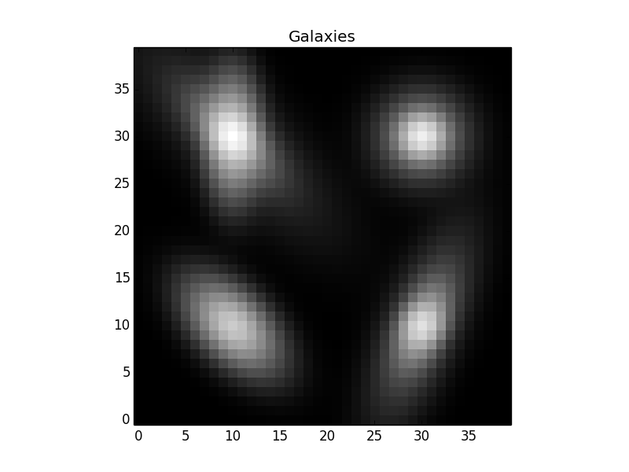

Introduction to using The Tractor (Part 2)
==========================================

Galaxies
--------

The Tractor currently supports parametric Exponential ("exp",
`ExpGalaxy`) and deVaucoulers ("dev", `DevGalaxy`) galaxies, composite
galaxies (deV+exp, `CompositeGalaxy` and `FixedCompositeGalaxy`), and
general Sersic galaxies (`SersicGalaxy`).  The dev and exp galaxies
are in the `tractor.galaxy` package, while Sersic is in
`tractor.sersic`.

Each of these galaxies is described by its position, brightness, and
an ellipse describing its shape.  Composite galaxies have a brightness
and shape for the dev and exp components.  FixedComposite has a single
brightness and a `FracDev` parameter describing how the flux is split
between the exp and dev components.  Sersic galaxies also a Sersic
index parameter.

A number of ellipse parameterizations are available, including
`GalaxyShape` (radius, axis ratio, and position angle; in
`galaxy.py`), `EllipseE` (radius, e1, e2)---which I believe are called
g1,g2 in GalSim, and `EllipseESoft` (log-radius, ee1, ee2), where
ee1,ee2 go through a sigmoid softening function (1-exp(-|ee|)) to get
to the standard e1,e2.  This parameterization has the advantage that
the parameter space is smooth and unbounded, which tends to make
optimizers happy.

Let's see an example of creating some Galaxy objects.

::

    import numpy as np
    import pylab as plt
    from tractor import *
    from tractor.galaxy import *
    from tractor.sersic import *

    # size of image
    W,H = 40,40

    # PSF size
    psfsigma = 1.

    # per-pixel noise
    noisesigma = 0.01

    # create tractor.Image object for rendering synthetic galaxy
    # images 
    tim = Image(data=np.zeros((H,W)), invvar=np.ones((H,W)) / (noisesigma**2),
                psf=NCircularGaussianPSF([psfsigma], [1.]))

    sources = [ ExpGalaxy(PixPos(10,10), Flux(10.), GalaxyShape(3., 0.5, 45.)),
                CompositeGalaxy(PixPos(10,30),
                                Flux(10.), EllipseE(3., 0.5, 0.),
                                Flux(10.), EllipseE(3., 0., -0.5)),
                SersicGalaxy(PixPos(30,10), Flux(10.),
                             EllipseESoft(1., 0.5, 0.5), SersicIndex(3.)),
                FixedCompositeGalaxy(PixPos(30,30), Flux(10.), 0.8,
                                     EllipseE(2., 0., 0.),EllipseE(1., 0., 0.))]

    tractor = Tractor([tim], sources)

    mod = tractor.getModelImage(0)

    # Plot
    plt.clf()
    plt.imshow(np.log(mod + noisesigma),
               interpolation='nearest', origin='lower', cmap='gray')
    plt.title('Galaxies')
    plt.savefig('7.png')

Notice that we can mix-and-match different ellipse types.  The image looks like:

